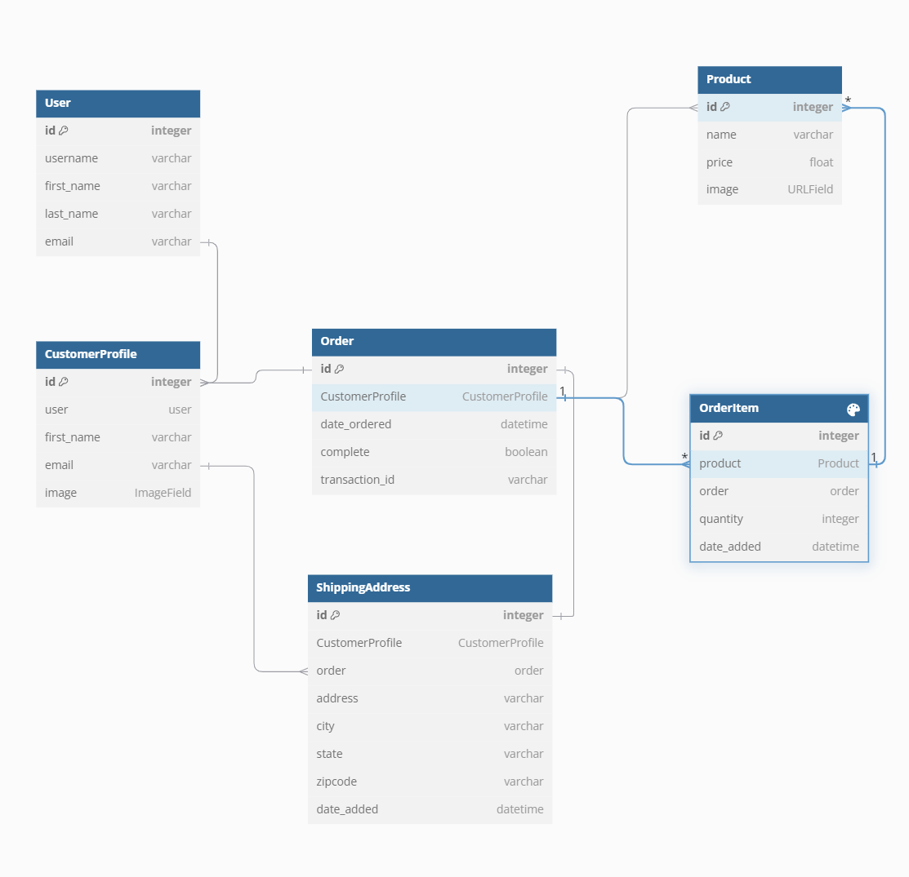

<head>
  <link rel="stylesheet" href="https://cdnjs.cloudflare.com/ajax/libs/font-awesome/4.7.0/css/font-awesome.min.css">
</head>

<body>

    
        <a href="https://climatechic-project.onrender.com" style="text-decoration: none;">
        ✩▁▂▃▅▆▓▒░ClimateChic░▒▓▆▅▃▂▁✩</a>
    

## Concept

•	“Climatechic” is a term that blends “climate” and “chic,” referring to fashion and lifestyle choices that are both stylish and environmentally conscious.

•	It emphasizes sustainability, ethical production, and eco-friendly practices in the fashion industry.

•	The name suggests a platform that offers trendy and fashionable clothing options while also promoting sustainability and climate-friendly choices.

•	Breakdown of “Cliamtechic”
1.	**Cliam**:
      A creative twist on the word “climatic,” which relates to climate or weather conditions. It suggests that website takes into account the climate or weather when offering shopping options.
2.	**Tech**:
      This part of the name emphasizes the technological aspect of platform. It indicates that website uses technology to provide a unique shopping experience, possibly through weather-based recommendations or smart algorithms.
3.	**Chic**:
      “Chic” is a term that denotes style and elegance. It implies that the products available on website are not only practical for the weather but also fashionable and stylish.

## Features

- **Django Management Command**

In this project, a Django management command is used to initialize the database with product data fetched from an external product API. This command automates the process of populating the database.

- **Cookies for Guest Cart**

The project uses cookies to manage the shopping cart for guest users. This allows users who are not logged in to add products to their cart and retain this information across sessions, providing a seamless shopping experience.

- **Reusable Headers and Footers**

The project employs reusable headers and footers across different HTML pages. This is achieved by creating separate template files for the header and footer and including them in other templates using Django's template inheritance and inclusion tags.

- **Mobile Navigation Menu Slider**

A mobile navigation menu slider is implemented to enhance the user experience on mobile devices. This feature allows users to easily navigate through the website using a sliding menu that is optimized for touch interactions.

- **JavaScript-based Form Validations**

JavaScript is used for client-side form validations to provide immediate feedback to users. This ensures that form inputs meet the required criteria before submission, improving the overall user experience and reducing server-side validation errors.

- **Usage of Environment Variables**

Environment variables are used to manage sensitive information and configuration settings securely. Tools like `python-decouple` are employed to read these variables from a `.env` file, keeping them out of the source code and enhancing security.

# Database design

This project will include six models. Here’s a brief overview of each:

- **USER**: Utilizes Django’s built-in user model, creating an instance for every registered customer.

- **CUSTOMER**: Each customer will have a Customer model in addition to the User model, maintaining a one-to-one relationship with the User model (OneToOneField).

- **PRODUCT**: Represents the different types of products available in the store.
 
- **ORDER**: This model captures transactions, whether completed or pending. It includes details like transaction ID, completion date, and order status. It is a child of the Customer model and a parent to Order Items.
 
- **ORDERITEM**: Represents individual items within an order. For instance, a shopping cart may contain multiple items, all part of a single order. Thus, the OrderItem model is a child of both the Product and Order models.
 
- **SHIPPING**: Not all orders require shipping information. For orders with physical products that need shipping, an instance of the Shipping model will be created to specify the delivery address. The Shipping model is a child of the Order model when necessary.

## Deployment steps on Render.com
Use this pdf for step by step instruction - Deployment Steps (https://github.com/Irenetitor/climatechic-project/blob/main/docs/Deployment_Steps.pdf)

## Instructions to access

Website url - https://climatechic-project.onrender.com  <i class="fa fa-hand-o-left"></i>

To access this website for desktop, tablet and mobile, different methods depending on the device and browser can be used. Here are some general instructions for each device type:

- For desktop: Use any web browser to access a website by typing its URL in the address bar and pressing Enter.

- For tablet: You can use a web browser app to access a website by typing its URL in the address bar and tapping Go.

- For mobile: You can use a web browser app to access a website by typing its URL in the address bar and tapping Go.

## Resources

1. **Django Documentation**:
    - [Django Official Documentation](https://docs.djangoproject.com/en/stable/): Comprehensive guide and reference for Django.

2. **Django Packages**:
    - [Django Crispy Forms](https://django-crispy-forms.readthedocs.io/en/latest/): For better form rendering.
    - [Whitenoise](http://whitenoise.evans.io/en/stable/): For serving static files in production.

3. **Database**:
    - [PostgreSQL Documentation](https://www.postgresql.org/docs/): Official documentation for PostgreSQL.
    - [dj-database-url](https://pypi.org/project/dj-database-url/): Utility to configure database URLs.

4. **Environment Variables**:
    - [python-decouple](https://pypi.org/project/python-decouple/): For managing environment variables.

5. **Frontend**:
    - [Bootstrap 5](https://getbootstrap.com/docs/5.0/getting-started/introduction/): For responsive design and styling.

6. **Deployment**:
    - [Render](https://render.com/docs): Documentation for deploying applications on Render.

8. **Email Services**:
    - [SendGrid](https://sendgrid.com/docs/): For sending emails from your application.

## License
This project is licensed under the MIT License - see the LICENSE file for details.
